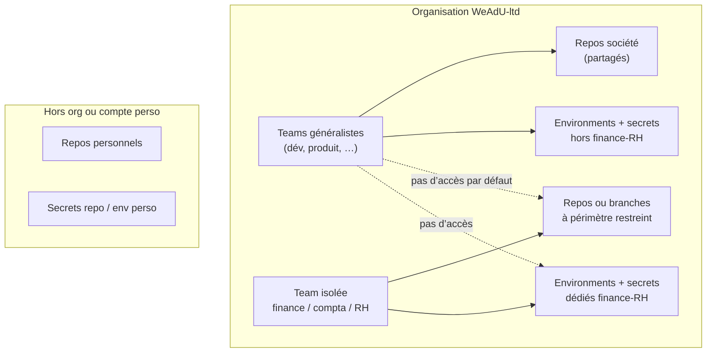

# WEA-13 — GitHub : modèle d’accès (interne partagé, perso, finance-RH isolé)

Document de cadrage pour le ticket [WEA-13](https://linear.app/weadu/issue/WEA-13/github-modele-dacces-interne-partage-perso-finance-rh-isole). Il s’appuie sur l’inventaire [WEA-12](https://linear.app/weadu/issue/WEA-12/github-inventaire-orgs-comptes-repos-et-acces) (`docs/inventory/WEA-12-github-linear.md`, `docs/GITHUB_LINEAR_INVENTORY_WEA12.md`).

**Statut du schéma** : validé comme **approximation opérationnelle** ; les noms d’équipes exacts et la liste des dépôts à déplacer restent à finaliser après inventaire complet (WEA-12).

---

## 1. Schéma « qui voit quoi »

### 1.1 Trois périmètres

| Périmètre | Où ça vit (GitHub) | Qui y a accès | Secrets / CI |
|-----------|-------------------|---------------|--------------|
| **Société — interne partagé** | Organisation `WeAdU-ltd`, repos d’équipe | Membres org + **teams** métier / technique avec droits repo adaptés | **Environments** partagés (ex. `staging`, `production`) + secrets org/repo **hors** finance-RH |
| **Personnel** | Compte utilisateur (`owner` perso) ou repos **sans** rattachement équipe société | Uniquement le propriétaire (et éventuels collaborateurs invités **au repo**, pas via la même équipe société) | Secrets **repo** ou **environnements** du repo perso uniquement ; **aucun** secret société critique |
| **Compta / finance / RH — isolé** | Sous-ensemble de repos `WeAdU-ltd` **et/ou** environnements secrets **dédiés** | **Team GitHub dédiée** (ex. `finance-rh`) avec politique **minimum nécessaire** ; pas d’élargissement aux teams généralistes | **Environments** dédiés (ex. `production-finance`, `hr-batch`) + secrets **nommés** séparés ; pas de réutilisation des secrets « généralistes » |

### 1.2 Diagramme (vue logique)

### 1.3 Principes

- **Séparation des secrets** : ce qui touche paie, fiscalité, données RH ne transite pas par les mêmes GitHub Environments ni les mêmes noms de secrets que le reste du socle (alignement futur [WEA-15](https://linear.app/weadu/issue/WEA-15/secrets-socle-partage-org-github-cursor-isolation-finance-rh)).
- **Repos perso** : pas de label Linear `repo` société ; pas d’injection de PAT org dans des workflows perso pour toucher des ressources société.
- **Agents / Cursor** : un ticket « code » = un label enfant du groupe `repo` ([WEA-17](https://linear.app/weadu/issue/WEA-17/charte-agents-linear-source-interdits-features-nouveaux-projets)) ; les agents sur périmètre finance-RH ne doivent pas cibler un dépôt « large » par défaut.

---

## 2. Backlog d’actions concrètes sur GitHub

À traiter comme **checklist** ; cocher au fur et à mesure. Certaines lignes dépendent de la liste exacte des repos (WEA-12).

| # | Action | Détail |
|---|--------|--------|
| 1 | **Créer ou valider une team `finance-rh` (nom à figer)** | Org → **Teams** ; membres minimalistes ; repos assignés un par un |
| 2 | **Cartographier les repos « sensibles »** | À partir de l’inventaire WEA-12 : marquer compta / paie / données RH |
| 3 | **Déplacer ou dupliquer** | Si un repo mélange sujets : scinder en `…-finance` / `…-core` ou isoler par **dossiers + protections** en dernier recours |
| 4 | **Environments dédiés** | Sur chaque repo concerné : créer `production-finance` (ex.) avec **protection rules** (reviewers obligatoires = sous-ensemble team finance-RH) |
| 5 | **Secrets** | Créer des secrets **par environment** isolé ; ne pas réutiliser `PRODUCTION_*` génériques pour les jobs RH/finance |
| 6 | **Branch protection** | `main` (ou branche prod) : approbations requises pour repos finance-RH ; voir aussi [WEA-32](https://linear.app/weadu/issue/WEA-32/github-protections-branches-anti-secrets-en-clair) |
| 7 | **Repos personnels** | S’assurer qu’aucun **deploy key** / PAT org n’y est stocké ; documenter la liste des comptes perso utilisés pro |
| 8 | **SSO / audit** | Si SAML : vérifier que les comptes avec accès `finance-rh` sont bien comptes pro contrôlés |

### 2.1 Issues Linear liées (suite logique)

| Ticket | Rôle |
|--------|------|
| [WEA-12](https://linear.app/weadu/issue/WEA-12/github-inventaire-orgs-comptes-repos-et-acces) | Liste des repos, labels `repo`, trous |
| [WEA-15](https://linear.app/weadu/issue/WEA-15/secrets-socle-partage-org-github-cursor-isolation-finance-rh) | Socle secrets (1Password / GitHub / Cursor) cohérent avec ce modèle |
| [WEA-32](https://linear.app/weadu/issue/WEA-32/github-protections-branches-anti-secrets-en-clair) | Protections branches + anti-secrets en clair |

---

## 3. Critères de fait (auto-contrôle)

| Critère | Ce document |
|--------|-------------|
| Schéma validé (même approximatif) : qui voit quoi | Tableau §1.1 + diagramme §1.2 + principes §1.3 |
| Liste d’actions GitHub ou backlog lié | Table §2 + renvois Linear §2.1 |

---

_Dernière mise à jour : alignement avec le dépôt `WeAdU-ltd/.github` (documentation agents)._
